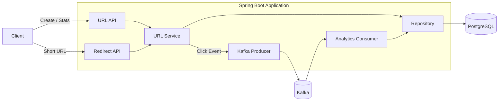
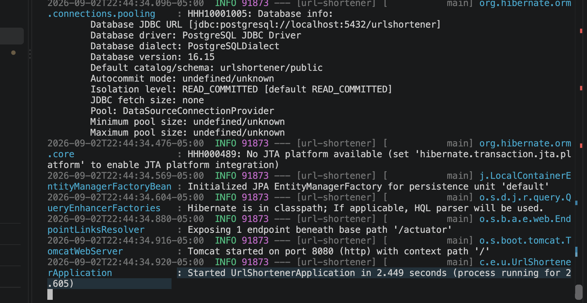
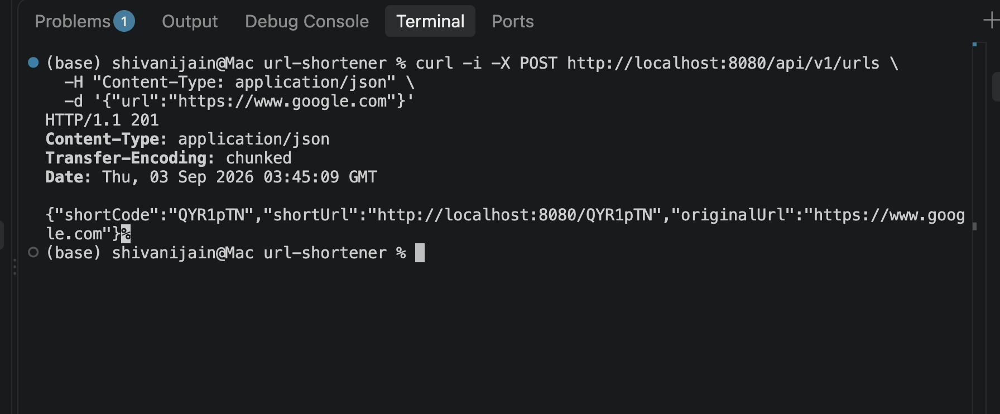
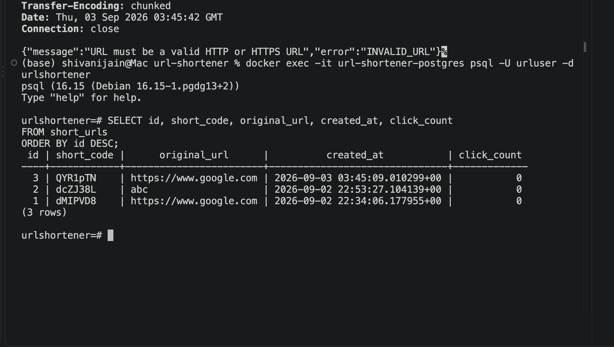
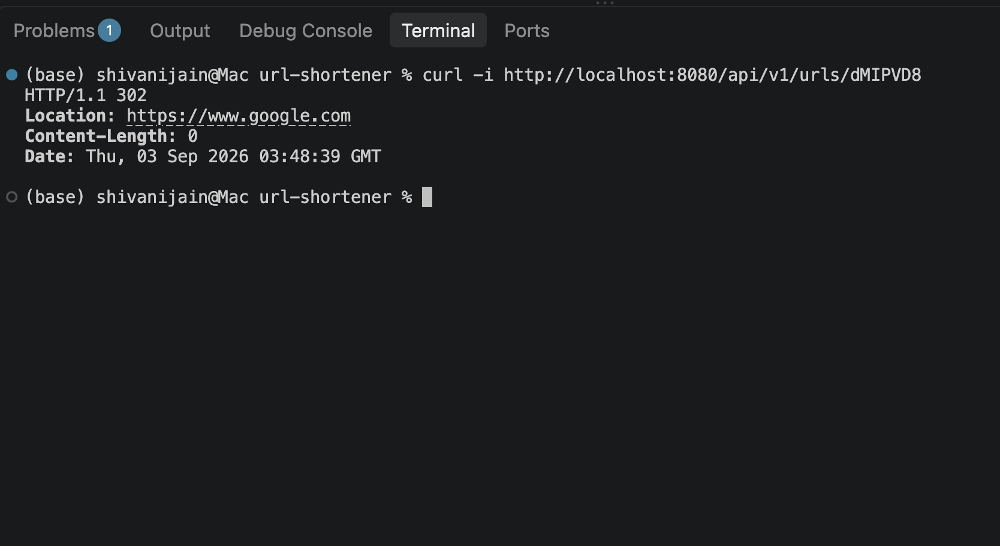
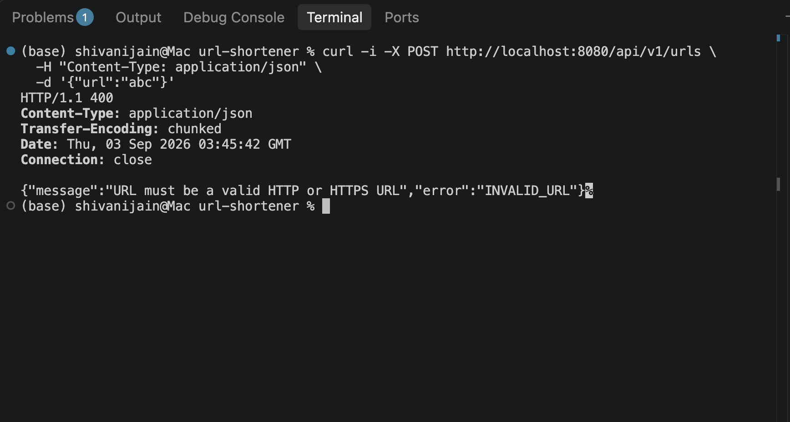
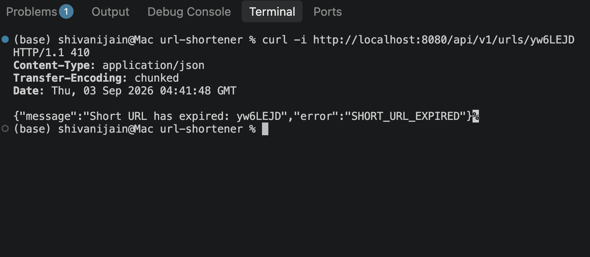

# AI-Assisted URL Shortener

A production-oriented URL shortener prototype built with Java, Spring Boot, PostgreSQL, and Kafka.

The project demonstrates not only a working backend service, but also how AI can be used as part of an engineer-led development workflow for requirement analysis, implementation, testing, debugging, and review.

AI was used as an engineering assistant. Design decisions, validation, code changes, and final approval remained developer-owned.

---

## Features

* Create shortened URLs
* Redirect short URLs using HTTP `302`
* Validate submitted URLs
* Optional URL expiration
* `410 Gone` handling for expired URLs
* PostgreSQL persistence
* Flyway database migrations
* Asynchronous click analytics using Kafka
* Click count and last-accessed tracking
* Analytics REST endpoint
* Centralized exception handling
* Externalized application configuration
* Service and controller tests
* Docker Compose infrastructure
* AI-assisted engineering traceability

---

## Tech Stack

| Area            | Technology                  |
| --------------- | --------------------------- |
| Language        | Java 17                     |
| Framework       | Spring Boot                 |
| REST API        | Spring Web                  |
| Persistence     | Spring Data JPA / Hibernate |
| Database        | PostgreSQL 16               |
| Migrations      | Flyway                      |
| Messaging       | Apache Kafka                |
| Build           | Maven                       |
| Testing         | JUnit 5, Mockito, MockMvc   |
| Infrastructure  | Docker / Docker Compose     |
| Version Control | Git / GitHub                |

---

## Architecture

The application separates API handling, business logic, persistence, and asynchronous analytics.



More detail is available in [Architecture Overview](docs/architecture.md).

---

## Core Flow

### Create a shortened URL

```text
Client
  |
  v
POST /api/v1/urls
  |
  v
Validate URL
  |
  v
Generate short code
  |
  v
PostgreSQL
  |
  v
Return public short URL
```

### Redirect

```text
GET /{shortCode}
      |
      v
Lookup URL
      |
      v
Check expiration
      |
      +----> Publish Kafka click event
      |
      v
HTTP 302 Redirect
```

### Analytics

```text
Kafka click event
       |
       v
Analytics Consumer
       |
       v
Update click_count
Update last_accessed_at
       |
       v
PostgreSQL
```

Analytics are eventually consistent so the database update does not need to be performed directly as part of the redirect logic.

---

# Getting Started

## Prerequisites

Install:

* Java 17+
* Docker
* Maven is optional because the project includes the Maven wrapper

Verify Java:

```bash
java -version
```

Verify Docker:

```bash
docker --version
```

---

## 1. Clone the Repository

```bash
git clone https://github.com/munsquare26/ai-assisted-url-shortener.git
cd ai-assisted-url-shortener
```

---

## 2. Start Infrastructure

PostgreSQL and Kafka are defined in `docker-compose.yml`.

Start them with:

```bash
docker compose up -d
```

Verify:

```bash
docker ps
```

You should see containers for:

```text
url-shortener-postgres
url-shortener-kafka
```

---

## 3. Run Tests

```bash
./mvnw test
```

The project currently contains 15 automated tests covering service and HTTP behavior.

---

## 4. Start the Application

```bash
./mvnw spring-boot:run
```

The application starts at:

```text
http://localhost:8080
```

Flyway automatically applies the database migrations during startup.

---

# API Usage

## Create a Short URL

### Request

```bash
curl -i \
  -X POST http://localhost:8080/api/v1/urls \
  -H "Content-Type: application/json" \
  -d '{"url":"https://www.google.com"}'
```

### Example Response

```json
{
  "shortCode": "dMIPVD8",
  "shortUrl": "http://localhost:8080/dMIPVD8",
  "originalUrl": "https://www.google.com"
}
```

The exact short code is randomly generated and will differ between requests.

---

## Use the Short URL

```bash
curl -i http://localhost:8080/dMIPVD8
```

Example:

```text
HTTP/1.1 302
Location: https://www.google.com
```

The public short URL returned by the creation API is therefore directly usable.

---

## Create a URL With Expiration

Expiration is optional.

```bash
curl -i \
  -X POST http://localhost:8080/api/v1/urls \
  -H "Content-Type: application/json" \
  -d '{
    "url":"https://www.example.com",
    "expiresAt":"2026-09-10T12:00:00Z"
  }'
```

If `expiresAt` is omitted, the URL does not expire.

Expired URLs return:

```text
HTTP 410 Gone
```

---

## View Analytics

```bash
curl http://localhost:8080/api/v1/urls/dMIPVD8/stats
```

Example response:

```json
{
  "shortCode": "dMIPVD8",
  "originalUrl": "https://www.google.com",
  "clickCount": 3,
  "createdAt": "2026-09-02T22:34:06.177955Z",
  "lastAccessedAt": "2026-09-03T05:07:35.338241Z",
  "expiresAt": null
}
```

Analytics are updated asynchronously through Kafka, so the count may not change immediately after the redirect request.

---

# Error Behavior

## Invalid URL

Example:

```bash
curl -i \
  -X POST http://localhost:8080/api/v1/urls \
  -H "Content-Type: application/json" \
  -d '{"url":"abc"}'
```

Response:

```text
HTTP 400 Bad Request
```

Example body:

```json
{
  "error": "INVALID_URL",
  "message": "Only HTTP and HTTPS URLs are supported"
}
```

Only `http` and `https` URLs with a valid host are accepted.

---

## Unknown Short Code

```bash
curl -i http://localhost:8080/does-not-exist
```

Response:

```text
HTTP 404 Not Found
```

---

## Expired Short URL

An expired short URL returns:

```text
HTTP 410 Gone
```

`410` was selected instead of `404` because the shortened resource previously existed but is no longer available.

---

# Working Example

## Spring Boot Application Running



## Create Short URL



## Database Record



## Redirect Short URL



## Invalid URL Validation



## Expired URL




The project was manually validated in addition to automated testing.
---

# Database

The application uses PostgreSQL as its persistent data store.

The main table is:

```text
short_urls
```

It stores:

```text
id
short_code
original_url
created_at
expires_at
click_count
last_accessed_at
```

`short_code` has a database-level unique constraint.

---

## Database Migrations

Schema changes are managed through Flyway.

Initial schema:

```text
V1__create_short_urls_table.sql
```

Expiration was added later through:

```text
V2__add_url_expiration.sql
```

The second migration intentionally keeps `expires_at` nullable so URLs created before expiration support retain their existing behavior.

---

# Kafka Analytics

A successful redirect publishes a `UrlClickEvent`.

The event contains:

```text
shortCode
clickedAt
```

The Kafka consumer processes the event and updates:

```text
click_count
last_accessed_at
```

Requests for unknown or expired URLs do not produce click events.

This gives the project a clear definition of a click:

> A click is a successful redirect of an existing, non-expired short URL.

---

# Configuration

Configuration can be overridden through environment variables.

Important values include:

| Variable                  | Local Default           |
| ------------------------- | ----------------------- |
| `DB_USERNAME`             | `urluser`               |
| `DB_PASSWORD`             | `urlpassword`           |
| `APP_BASE_URL`            | `http://localhost:8080` |
| `KAFKA_BOOTSTRAP_SERVERS` | `localhost:9092`        |

For example:

```bash
APP_BASE_URL=https://sho.rt ./mvnw spring-boot:run
```

Application URLs are therefore not tied to `localhost` in the Java implementation.

---

# Testing

Run the automated test suite with:

```bash
./mvnw test
```

The project currently contains 15 passing tests.

Tests cover behavior including:

* successful URL creation
* URL validation
* short-code lookup
* unknown short codes
* optional expiration
* expired URLs
* click event publishing
* HTTP `201 Created`
* HTTP `302 Found`
* HTTP `400 Bad Request`
* HTTP `404 Not Found`
* HTTP `410 Gone`
* analytics API responses

Manual end-to-end validation was also performed against real PostgreSQL and Kafka containers.

This was important because one Kafka serializer compatibility problem appeared only when the real application context and consumer were started.

---

# Engineering Scenarios

The implementation was developed around three engineering scenarios.

## 1. Greenfield

Build the initial URL-shortening capability.

This included:

```text
REST API
URL validation
short-code generation
PostgreSQL persistence
redirect behavior
error handling
tests
```

## 2. Brownfield

Add optional URL expiration to the already working system.

The change introduced:

```text
expires_at
```

through a new Flyway migration while preserving existing records.

## 3. Ambiguous Requirement

The initial requirement was:

> Track analytics for shortened URLs.

Before implementation, questions were identified around what constitutes a click, expired URLs, missing URLs, consistency, latency, and failure behavior.

The final definition became:

> A click is a successful redirect of an existing, non-expired short URL. Analytics are processed asynchronously through Kafka and are eventually consistent.

The complete reasoning and validation for all three scenarios is documented in [Engineering Scenarios](docs/scenarios.md).

---

# AI-Assisted Engineering

AI was used throughout development as an engineering assistant rather than as an autonomous implementation system.

Tools used included:

* ChatGPT for requirement decomposition, design discussion, debugging, test ideas, and review
* GitHub Copilot for coding assistance during implementation

The developer remained responsible for:

* deciding which suggestions to use
* changing or rejecting unsuitable suggestions
* running tests
* debugging failures
* validating integrations
* making design decisions
* reviewing the resulting implementation
* approving the final code

---

## Examples of AI-Assisted Iteration

AI suggestions were not assumed to be correct.

Several suggestions required changes after validation.

### Validation ordering

A negative test exposed that repository work happened before invalid URL input was rejected.

The implementation was changed so URL validation occurs first.

### Configuration injection

Moving the application base URL into configuration initially caused manually constructed service tests to receive a null base URL.

The design was changed to constructor injection.

### Kafka integration

The initial Kafka JSON serializer/deserializer configuration was incompatible with the Spring Boot 4 / Spring Kafka 4 dependency stack.

Unit tests did not expose the issue.

Starting the complete application exposed the runtime failure, the configuration was corrected, and the full Kafka producer-to-consumer-to-PostgreSQL flow was manually validated.

These cases are intentionally documented because they demonstrate why AI-generated output still requires engineering review and validation.

The detailed development trace is available in [AI Usage Log](docs/ai-usage-log.md).

---

# Key Engineering Decisions

## PostgreSQL for persistence

URL mappings need to survive application restarts and require a reliable uniqueness guarantee.

PostgreSQL provides persistence and a unique constraint for short codes.

---

## Database constraint as the final uniqueness guard

The application checks whether a generated code already exists.

However, two concurrent requests could theoretically pass the existence check simultaneously.

For that reason, the database unique constraint remains the final integrity guarantee.

A production version should retry generation when a uniqueness conflict occurs.

---

## Kafka for asynchronous analytics

Click analytics do not need to be immediately consistent.

Kafka allows analytics processing to be separated from the main redirect logic.

The tradeoff is additional infrastructure and eventual consistency.

---

## Flyway for schema evolution

Expiration was introduced through a new migration instead of modifying the original database migration.

This preserves migration history and models how an existing production database would evolve.

---

## Separate public and management endpoints

Management operations use:

```text
/api/v1/urls
```

Public redirects use:

```text
/{shortCode}
```

This makes the generated short URL concise while keeping API operations organized.

---

# Known Limitations and Production Improvements

This is a prototype rather than a complete internet-scale URL-shortening platform.

Important improvements for a production deployment would include:

* retrying short-code generation after unique constraint conflicts
* atomic click-count updates for higher concurrency
* Kafka retry and dead-letter handling
* stronger handling of Kafka outages
* idempotent analytics event processing
* explicit Kafka topic and partition configuration
* an outbox pattern for stronger event publication guarantees
* rate limiting
* authentication/authorization for management and analytics APIs
* abuse and phishing protection
* observability dashboards
* distributed tracing
* metrics and alerting
* automated integration tests using containerized PostgreSQL and Kafka
* load and performance testing

The current implementation intentionally favors a small, reviewable prototype while documenting where stronger production guarantees would be required.

---

# Project Structure

```text
src/
├── main/
│   ├── java/com/example/url_shortener/
│   │   ├── analytics/
│   │   ├── controller/
│   │   ├── dto/
│   │   ├── entity/
│   │   ├── exception/
│   │   ├── repository/
│   │   ├── service/
│   │   └── util/
│   └── resources/
│       ├── db/migration/
│       └── application.properties
│
└── test/
    └── java/com/example/url_shortener/
        ├── controller/
        └── service/

docs/
├── architecture.md
├── scenarios.md
├── ai-usage-log.md
└── screenshots/

docker-compose.yml
pom.xml
README.md
```

---

# Documentation

For reviewers:

* [Architecture Overview](docs/architecture.md) — system design, components, data flow, and tradeoffs
* [Engineering Scenarios](docs/scenarios.md) — greenfield, brownfield, and ambiguous-requirement walkthroughs
* [AI Usage Log](docs/ai-usage-log.md) — AI-assisted development decisions, failures, corrections, and validation

---

# Final Summary

This project demonstrates a complete engineering workflow around a relatively small backend system.

The implementation includes:

```text
Requirement
    ↓
Decomposition
    ↓
Design
    ↓
AI-assisted implementation
    ↓
Automated testing
    ↓
Runtime validation
    ↓
Failure investigation
    ↓
Engineering corrections
    ↓
End-to-end verification
    ↓
Human review
```

The final prototype supports URL shortening, redirects, optional expiration, PostgreSQL persistence, asynchronous Kafka analytics, analytics retrieval, schema migrations, validation, automated tests, and documented engineering tradeoffs.

AI accelerated parts of the workflow, but the implementation was treated as engineer-owned throughout.
