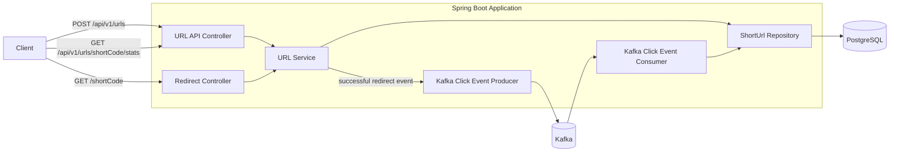

# Architecture Overview

## 1. Purpose

This project is a URL shortener implemented as a small Spring Boot service.

The system supports:

* creating shortened URLs
* redirecting short codes to original URLs
* optional URL expiration
* asynchronous click analytics
* viewing analytics for a shortened URL

The implementation is intentionally small enough to understand quickly, while still demonstrating production-oriented concerns such as validation, database migrations, asynchronous processing, testing, and failure handling.

---

## 2. Technology Stack

* Java 17
* Spring Boot
* Spring Web
* Spring Data JPA / Hibernate
* PostgreSQL
* Flyway
* Apache Kafka
* Maven
* JUnit 5
* Mockito
* Docker / Docker Compose

---

## 3. High-Level Architecture



---

## 4. Main Components

### UrlController

Handles API-oriented operations.

Current responsibilities include:

* creating a shortened URL
* retrieving analytics for an existing short code

Example endpoints:

```text
POST /api/v1/urls
GET /api/v1/urls/{shortCode}/stats
```

The controller remains thin and delegates business logic to `UrlService`.

---

### RedirectController

Handles the public short URL.

Example:

```text
GET /dMIPVD8
```

The controller resolves the short code through `UrlService` and returns an HTTP `302` response with the original URL in the `Location` header.

Keeping the redirect endpoint separate from the management API allows the generated short URL to remain simple:

```text
http://localhost:8080/dMIPVD8
```

instead of exposing an internal API-style path.

---

### UrlService

Contains the main application logic.

Responsibilities include:

* validating original URLs
* generating unique short codes
* creating and storing shortened URLs
* resolving short codes
* checking expiration
* publishing click events after successful redirects
* retrieving URL information used by the stats endpoint

The service layer prevents HTTP concerns and persistence details from being mixed together.

---

### ShortUrlRepository

Uses Spring Data JPA to access PostgreSQL.

Primary operations include:

* storing shortened URLs
* finding a URL by its short code
* checking whether a generated short code already exists

The database also contains a unique constraint on `short_code`, which acts as the final integrity guard against duplicate codes.

---

### ShortCodeGenerator

Generates random short codes using `SecureRandom`.

The current code length is seven characters using a Base62-style character set.

The service checks whether a generated code already exists before saving it.

The PostgreSQL unique constraint remains the final source of truth because an application-level existence check alone cannot fully prevent a race condition between concurrent requests.

---

### UrlClickEventProducer

Publishes a Kafka event after a valid short URL is successfully resolved.

The event contains:

```text
shortCode
clickedAt
```

Analytics publishing happens outside the direct database update logic for the redirect.

This separates the redirect use case from analytics processing.

---

### UrlClickEventConsumer

Consumes click events from Kafka.

For each valid event, it updates:

```text
click_count
last_accessed_at
```

in PostgreSQL.

This means analytics are eventually consistent rather than immediately updated as part of the redirect request.

---

## 5. Database Model

The main table is:

```text
short_urls
```

Important columns include:

| Column             | Purpose                                  |
| ------------------ | ---------------------------------------- |
| `id`               | Internal database identifier             |
| `short_code`       | Public shortened identifier              |
| `original_url`     | Original destination URL                 |
| `created_at`       | Creation timestamp                       |
| `expires_at`       | Optional expiration timestamp            |
| `click_count`      | Number of processed successful redirects |
| `last_accessed_at` | Timestamp of the latest processed click  |

Database schema changes are managed with Flyway.

The initial table is created by:

```text
V1__create_short_urls_table.sql
```

Expiration support was added later through:

```text
V2__add_url_expiration.sql
```

Using a migration instead of modifying the original schema demonstrates how an existing system can evolve without recreating existing data.

---

## 6. Create URL Flow

Example request:

```text
POST /api/v1/urls
```

```json
{
  "url": "https://www.google.com"
}
```

Flow:

```text
Client
  |
  v
UrlController
  |
  v
UrlService
  |
  +--> Validate URL
  |
  +--> Generate short code
  |
  +--> Check for existing code
  |
  +--> Save ShortUrl
  |
  v
PostgreSQL
```

The response includes:

* the generated short code
* the usable public short URL
* the original URL

---

## 7. Redirect Flow

Example request:

```text
GET /dMIPVD8
```

Flow:

```text
Client
  |
  v
RedirectController
  |
  v
UrlService
  |
  +--> Find short code
  |
  +--> Check expiration
  |
  +--> Publish click event
  |
  v
HTTP 302
```

The client receives the redirect without requiring analytics processing to be performed directly in the redirect service method.

---

## 8. Analytics Flow

Analytics are processed asynchronously.

```text
Successful redirect
       |
       v
UrlClickEventProducer
       |
       v
     Kafka
       |
       v
UrlClickEventConsumer
       |
       v
 PostgreSQL
```

Only a successfully resolved, non-expired short URL produces a click event.

The following do not count as clicks:

* unknown short codes
* expired short URLs

This decision avoids inflating analytics with unsuccessful requests.

---

## 9. Expiration Behavior

Expiration was introduced as a brownfield-style change.

`expires_at` is nullable.

A value of:

```text
NULL
```

means that the URL does not expire.

This preserves the behavior of URLs created before expiration support existed.

When an expired URL is requested, the service returns:

```text
HTTP 410 Gone
```

rather than `404 Not Found`.

The URL previously existed, so `410` communicates the state more accurately.

---

## 10. Validation

The service validates submitted URLs before performing repository operations.

Currently accepted schemes are:

```text
http
https
```

The URL must also contain a valid host.

Examples such as:

```text
abc
javascript:alert(1)
```

are rejected.

Validation is intentionally performed before database access so invalid input fails early and does not trigger unnecessary repository work.

---

## 11. Error Handling

The application uses centralized exception handling.

Current application-level errors include:

### Invalid URL

```text
HTTP 400 Bad Request
```

Example error code:

```text
INVALID_URL
```

### Unknown short code

```text
HTTP 404 Not Found
```

Example error code:

```text
SHORT_URL_NOT_FOUND
```

### Expired short URL

```text
HTTP 410 Gone
```

Example error code:

```text
SHORT_URL_EXPIRED
```

This keeps controllers focused on request handling rather than exception mapping.

---

## 12. Configuration

Environment-specific values are externalized rather than hard-coded.

Examples include:

```text
DB_USERNAME
DB_PASSWORD
APP_BASE_URL
KAFKA_BOOTSTRAP_SERVERS
```

Development defaults are provided for local execution.

For example:

```text
APP_BASE_URL=http://localhost:8080
```

This allows the same application code to run with different infrastructure configuration.

---

## 13. Testing Strategy

The project currently includes both service-level and controller-level tests.

The service tests cover business behavior such as:

* successful URL creation
* URL validation
* URL lookup
* missing short codes
* expiration
* click event publishing

Controller tests cover HTTP behavior such as:

* `201 Created`
* `302 Found`
* `400 Bad Request`
* `404 Not Found`
* `410 Gone`
* analytics response data

The project currently has 15 passing tests.

Manual end-to-end testing has also been used to verify integrations that unit tests cannot fully exercise.

Examples include:

* PostgreSQL persistence
* Flyway migrations
* public HTTP redirects
* Kafka producer/consumer behavior
* asynchronous analytics updates

---

## 14. Important Design Decisions

### Separate public redirect endpoint

The create API returns URLs such as:

```text
http://localhost:8080/dMIPVD8
```

The redirect endpoint therefore uses the root path rather than requiring clients to use an API-specific URL.

---

### Kafka for analytics

Analytics are not updated directly inside the redirect database transaction.

Kafka separates click processing from the core redirect flow and provides a foundation for scaling analytics processing independently.

The tradeoff is eventual consistency.

A stats request immediately after a redirect may temporarily show an older click count until the Kafka event is processed.

---

### Database-backed uniqueness

The application checks whether a generated short code already exists.

However, the unique database constraint is treated as the final integrity guarantee.

In a higher-concurrency production system, duplicate-key failures should also be retried with a newly generated code.

---

### Flyway for schema evolution

Expiration was added as a new database migration rather than modifying the initial migration.

This mirrors how schema changes should be handled after a system already contains persisted data.

---

## 15. Known Limitations and Future Improvements

The prototype intentionally leaves some production concerns as future improvements.

These include:

* atomic analytics counter updates for high-concurrency workloads
* retry and dead-letter handling for failed Kafka events
* stronger handling when Kafka is unavailable
* retrying short-code creation after a database uniqueness conflict
* rate limiting
* authentication for administrative or analytics APIs
* protection against URL-shortener abuse and phishing
* observability dashboards and distributed tracing
* automated integration tests using real PostgreSQL and Kafka containers
* configurable Kafka topic creation and partition strategy

For a larger production system, analytics events could also use an outbox pattern to provide stronger guarantees between the redirect database operation and Kafka publication.

---

## 16. Engineering Tradeoff

The implementation favors a simple, reviewable design over adding infrastructure that is unnecessary for the assignment.

The main synchronous path remains:

```text
HTTP request -> application -> PostgreSQL
```

Kafka is introduced only where asynchronous processing has a clear reason: click analytics.

This keeps the codebase small while still demonstrating separation of concerns, persistence, asynchronous messaging, backward-compatible schema evolution, and testable business logic.
